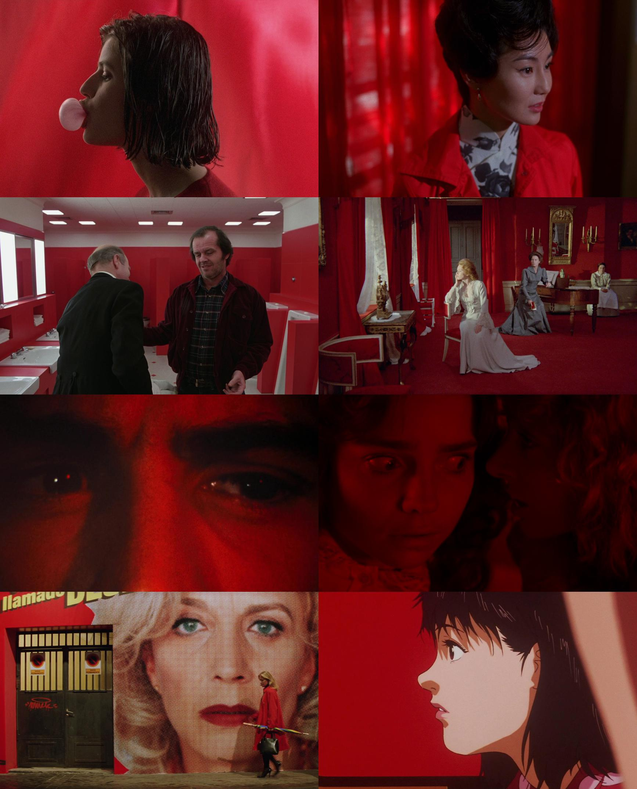
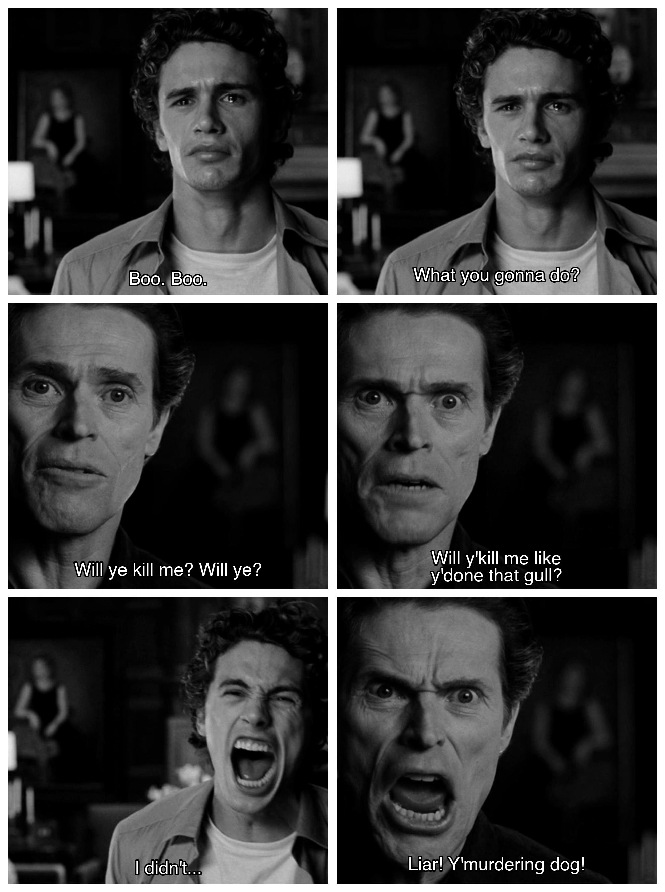

# kinobot

Commonly regarded as one of the most advanced bots on Facebook, Kinobot can handle complex request queries in less than a second and convert them into beautiful frames. The bot operates on [Facebook](https://www.facebook.com/certifiedkino/), [Discord](https://discord.gg/ZUfxf22Wqn), and its [website](https://kino.caretas.club).

### Examples

`!parallel Three Colors: Red 1994 [5:34] | In the Mood for Love 2000 [55:33] | The Shining 1980 [1:26:10] | Cries and Whispers 1972 [43:14] | Taxi Driver 1976 [1:12 --plus 400] | Suspiria 1977 [42:46] | All About My Mother 1999 [8:40] | Perfect Blue 1997 [22:23] --dimensions 2x4 --aspect-quotient 1.6 --contrast -5`

`!swap The Lighthouse 2019 [671-675 --remove-second][675 --remove-first] | Spider-Man 2 2004 [1149-1150] [1151 --plus 500 --x-crop-offset -50] [1:56:51 --plus 300 --x-crop-offset -50] [1154 --plus 500] [1154 --plus 200 --x-crop-offset -50] --dimensions 2x3 --color -100 --font helvetica --font-size 30 --y-offset 30 --stroke-width 5 --aspect-quotient 1.1 --border 3,3`

